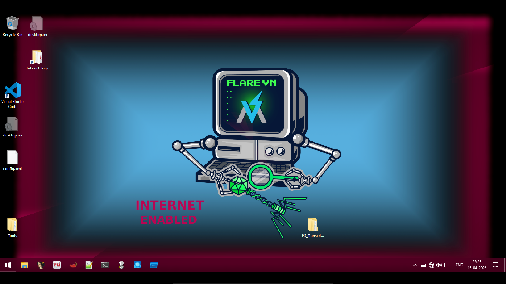

# 🔥 Win10 FLARE VM (Malware Analysis Lab)


---

## 🧪 FLARE VM Desktop



---

## 📦 Download

Due to GitHub size limits, the VM is split into parts.

### ☁️ Google Drive

* Part 1 (13GB): [Add Link]
* Part 2 (13GB): [Add Link]

### ☁️ MEGA

* Part 1: [[Mega Folder Link - Account 1](https://mega.nz/folder/J35EgJjI#q9XeJ9W2FSx76RHYsAiRTg)
  ]
* Part 2: [Mega Folder Link - Account 2]

⚠️ Download ALL parts from both links

---

## 🔐 Login Credentials

* **Username:** User
* **Password:** 1010

---

## ⚙️ FULL SETUP GUIDE

### 1️⃣ Download Files

Download ALL parts:

```bash
Win10 Pro.7z
Win10 Pro.7z.002
Win10 Pro.7z.003
```

⚠️ Keep all files in the same folder

---

### 2️⃣ Extract Files

1. Install **7-Zip**
2. Right-click `Win10 Pro.7z`
3. Click **Extract Here**

✔ Automatically combines all parts
✔ Output: `Win10 Pro.ova`

---

### 3️⃣ Import into VirtualBox

1. Open VirtualBox
2. Click **File → Import Appliance**
3. Select `Win10 Pro.ova`
4. Click **Next → Finish**

---

### 4️⃣ Configure Virtual Machine

After import:

#### 🧠 RAM

* Go to: **Settings → System → Motherboard**
* Set: **8GB – 12GB**

#### ⚙️ CPU

* Go to: **Settings → System → Processor**
* Set: **4 – 8 CPUs**

#### 💾 Storage

* Ensure at least **70GB free space**

---

### 5️⃣ Start the VM

1. Click **Start**
2. Login using password: `1010`

---

## 📸 Snapshot (VERY IMPORTANT)

After first boot:

1. Start VM
2. Login
3. Go to: **Machine → Take Snapshot**
4. Name it: `Clean State`

### ✅ Why Snapshot?

* Restore clean environment instantly
* Safe malware testing
* Avoid reinstalling VM

---

## ⚠️ Important Notes

* Do NOT rename split files
* Extract only from `.7z` file
* Keep all parts together
* Enable virtualization (VT-x / AMD-V)
* Recommended system: **16GB RAM or higher**

---

## 🎯 Use Cases

* Malware Analysis
* Reverse Engineering
* CTF Practice
* Cybersecurity Labs

---


## ⭐ Support

If this project helped you, give it a ⭐ on GitHub!

---
